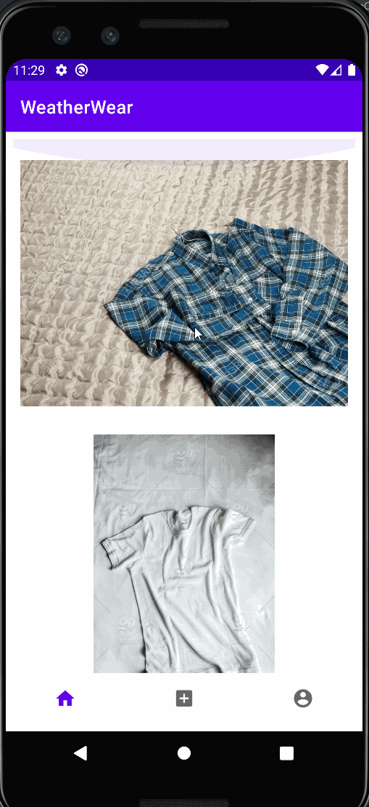

Original App Design Project - README Template
===

# Weather Wear

## Table of Contents
1. [Overview](#Overview)
1. [Product Spec](#Product-Spec)
1. [Wireframes](#Wireframes)
2. [Schema](#Schema)

## Overview
### Description
Weather Wear is a lifestyle app that recommends an outfit to the user based off the weather forecast for that day. Weather Wear also considers what the user has worn recently, the size of their wardrobe, and what colors go together the best.

### App Evaluation
[Evaluation of your app across the following attributes]
- **Category:** Lifestyle
- **Mobile:** Our app will first be developed for mobile but will have room to expand to desktop.
- **Story:** Analyzes users clothing choices and the current weather to recommend users fashion and weather appropriate clothing choices,
- **Market:** Any indivudual that wears can use the app.
- **Habit:** Our users should use this app as part of their daily morning routine.
- **Scope:** First we'll start with recommending outfits. In the future we can recommend clothes from online shops that users do not own yet. 

## Product Spec

### 1. User Stories (Required and Optional)

**Required Must-have Stories**

* ~~Login~~
* ~~Register~~
* ~~Homepage where you can ~~view weather ~~and reccomended outfit~~
* 7-day forecast and hour by hour weather breakdown
* Ability to change reccomended outfit
* ~~Upload new clothes~~

**Optional Nice-to-have Stories**

* Automatic color detector if picture is uploaded
* Favorite certain outfits you like
* Favorite outfits will be recommended 
* Block certain outfits so you won't get that combination ever
* Add support for shoes, socks, hats
* Favorite outfits in homepage + wardrobe
* Create outfit in wardrobe

### 2. Screen Archetypes

* ~~Login~~
* ~~Register~~
* ~~Homepage~~
   * Weather
   * ~~Recommended outfit~~
* Edit Recommended Outfit
* Wardrobe
   * ~~Add clothes~~
   * Create outfit
   * Favorited outfits
* Settings
   * Adjust location
* User profile
   * Stat display
      * Daily login counter
      * Does the user dress cold/warm?

### 3. Navigation

**Tab Navigation** (Tab to Screen)

* Homepage
* Wardrobe
* User profile
   * Settings

**Flow Navigation** (Screen to Screen)

* Forced Log-in -> Account creation if no log in is available
   * Leads to Homepage
* Homepage
   * Leads to Edit Recommended Outfit
   * Leads to Specific weather detail
* Wardrobe
   * Leads to outfit upload
* Profile
   * Leads to user profile
* Settings
   * Leads to app settings

## Wireframes


### [BONUS] Digital Wireframes & Mockups


### [BONUS] Interactive Prototype


## Schema 
[This section will be completed in Unit 9]
### Models
| Property | Type | Description |
| --- | --- | --- |
| userProfile | pointer to user | image of profile |
| image | File | image that user post/uploaded |
| likesCount | number | number of times an outfit is liked |
| dislikesCount | number | number of times an outfit is disliked |
| shirt | String | outfit type: shirt |
| pant | String | outfit type: pants |
| lastWorn | DateTime | when an outfit was last worn |
| user | String | username |
| password | String | user password |
### Networking
```swift
         let query = PFQuery(className:"Post")
         query.whereKey("author", equalTo: currentUser)
         query.order(byDescending: "createdAt")
         query.findObjectsInBackground { (shirts: [PFObject]?, error: Error?) in
            if let error = error { 
               print(error.localizedDescription)
            } else if let shirts = shirts {
               print("Successfully retrieved \(shirts.count) shirts.")
           // TODO: Do something with shirts...
            }
         }
```
- Wardrobe Screen
      - (Read/GET) Query all clothing saved by user
      - (Create/POST) Create a new shirt
      - (Delete) Delete an existing shirt
      - (Create/POST) Create a new pair of pants
      - (Delete) Delete an existing pair of pants
- Homepage
      - (Create/POST) Create a new liked outfit
      - (Delete) Delete an newly liked outfit
      - (Create/POST) Create a new disliked outfit
      - (Delete) Delete a newly disliked outfit
- Liked
      - (Read/GET) Read all liked outfits
      - (Delete) Delete an existing like
- Disliked
      - (Create/POST) Create a new disliked outfit
      - (Delete) Delete an existing disliked outfit
- Profile Screen
      - (Read/GET) Query logged in user object
      - (Update/PUT) Update user profile image
      - (Update/PUT) Update username
- [OPTIONAL: List endpoints if using existing API such as Yelp]


## Creating the Database and User Login/sign up page


## Homepage

